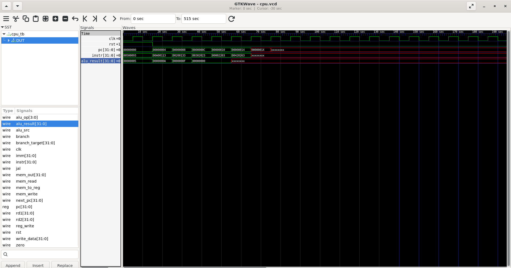
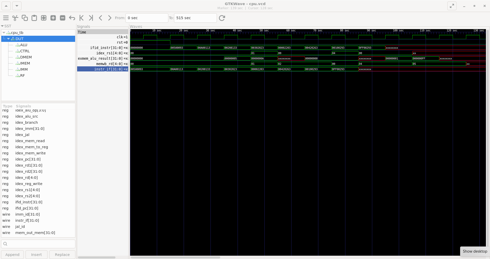
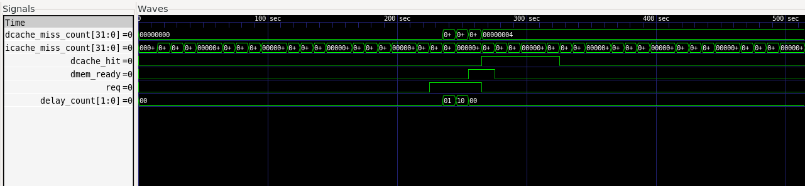
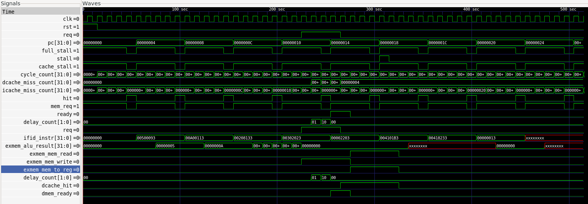
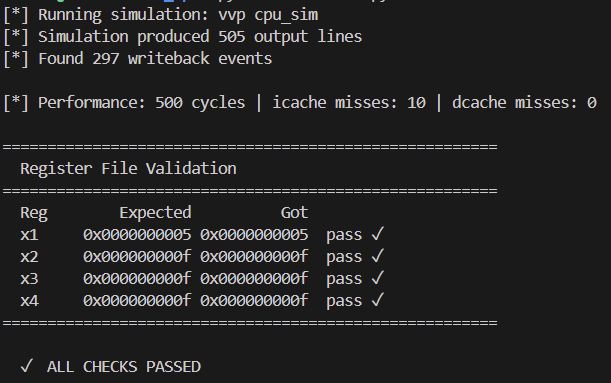

# ⚙️ 16-Bit RISC-V Processor with Cache

A 5-stage pipelined RISC-V CPU implemented in **Verilog HDL**, featuring full hazard detection, data forwarding, stall logic, and direct-mapped instruction/data caches — verified through GTKWave simulation and a Python register validation script.

---

## ✨ Features

- **5-stage pipeline**: IF → ID → EX → MEM → WB with full hazard handling
- **Data forwarding unit**: resolves RAW hazards from EX/MEM and MEM/WB stages without stalling
- **Hazard detection unit**: detects load-use hazards and injects stall bubbles
- **Direct-mapped instruction cache**: reduces instruction fetch stalls on repeated fetches
- **Direct-mapped data cache**: reduces memory-access latency on load/store instructions
- **Python validation**: automated register file verification against expected values after simulation

---

## 📐 Pipeline Architecture

```
  ┌────┐   ┌────┐   ┌────┐   ┌─────┐   ┌────┐
  │ IF │──▶│ ID │──▶│ EX │──▶│ MEM │──▶│ WB │
  └────┘   └────┘   └────┘   └─────┘   └────┘
              │        ▲         ▲
              │        └─────────┘
              │      Data Forwarding
              ▼
        Hazard Detection
        (stall / flush)
```

### Stage Breakdown

| Stage | Function |
|-------|----------|
| **IF** | Fetch instruction from instruction cache; update PC |
| **ID** | Decode instruction; read register file; generate control signals; detect hazards |
| **EX** | ALU operation; forwarding mux selects correct operand source |
| **MEM** | Data cache read/write; branch/jump resolution |
| **WB** | Write result back to register file |

---

## 🗂️ Cache Design

Both caches are **direct-mapped** and sit between the pipeline and a simulated main memory backed by a Verilog register array.

```
Address breakdown:
┌──────────┬───────┬────────┐
│   Tag    │ Index │ Offset │
└──────────┴───────┴────────┘
```

- **Hit**: data returned in the same cycle — no pipeline stall
- **Miss**: `cache_stall` signal asserted; all upstream pipeline registers frozen; memory fill completes; cache line updated

Separate instruction and data caches (Harvard-style at the cache level) avoid structural hazards between IF and MEM stages.

---

## ⚠️ Hazard Handling

### Data Forwarding

The forwarding unit compares the destination register of instructions in the EX/MEM and MEM/WB pipeline stages against the source registers of the instruction currently in EX. When a match is found, the forwarded value is muxed in directly, bypassing the stale register file output.

Priority: EX/MEM forwarding takes precedence over MEM/WB when both would forward to the same destination.

### Load-Use Hazard Detection

When a `lw` is followed immediately by an instruction that reads the loaded register, forwarding is not sufficient — the data isn't available until after the MEM stage. The hazard detection unit stalls the pipeline for one cycle by:

1. Freezing the PC and IF/ID register
2. Injecting a NOP bubble into ID/EX

---

## 📊 Simulation Results

### Pipeline Waveforms — Single-Cycle CPU

The following waveform shows the single-cycle CPU executing the test program. Key signals include `pc`, `instr`, `alu_result`, and `write_data`.

> 📷 **`docs/waveform_single_cycle.png`** — GTKWave: single-cycle datapath signals



### Pipeline Waveforms — Pipelined CPU

The pipelined waveform shows the IF/ID, ID/EX, and EX/MEM pipeline registers advancing in lockstep, with forwarding signals (`exmem_alu_result`) and stall signals visible.

> 📷 **`docs/waveform_pipeline.png`** — GTKWave: pipeline register signals, forwarding, and stall



### Cache Waveforms

The cache waveform shows `dcache_hit`, `icache_miss_count`, `dcache_miss_count`, `cache_stall`, `req`, `ready`, and `delay_count` across 500 simulation cycles. Cold misses on first-pass instruction fetches are clearly visible, after which the icache holds all hits.

> 📷 **`docs/waveform_cache.png`** — GTKWave: cache signals — hit, miss counters, stall, req/ready



> 📷 **`docs/waveform_cache_all_signals.png`** — GTKWave: full pipeline + cache signal overlay



---

## ✅ Python Validation

The `validate.py` script runs the simulation, reconstructs the register file from writeback events in the cycle log, and compares against expected values.

```bash
python3 validate.py
```

```
[*] Running simulation: vvp cpu_sim
[*] Simulation produced 505 output lines
[*] Found 297 writeback events
[*] Performance: 500 cycles | icache misses: 10 | dcache misses: 0

=======================================================
  Register File Validation
=======================================================
  Reg        Expected          Got
  x1     0x0000000005 0x0000000005  pass ✓
  x2     0x000000000f 0x000000000f  pass ✓
  x3     0x000000000f 0x000000000f  pass ✓
  x4     0x000000000f 0x000000000f  pass ✓
=======================================================
  ✓  ALL CHECKS PASSED
```

> 📷 **`docs/validation_output.png`** — Terminal output showing all register checks passing



### How it works

The script parses every `CY=` line from the simulation output, extracts cycles where `WBwe=1` (writeback enabled), and replays those events in order to reconstruct the final register file state. It stops at the first `jal` (halt loop) so spin-loop iterations don't pollute the results. All 32 registers are checked; any mismatch is reported as a `FAIL`.

---

## 🛠️ Repository Structure

```
├── src/
│   ├── pipeline_cpu.v      # Top-level pipelined CPU
│   ├── cpu.v               # Single-cycle reference CPU
│   ├── alu.v               # ALU
│   ├── regfile.v           # Register file
│   ├── control.v           # Control unit
│   ├── imm_decode.v        # Immediate decoder (all RV32I formats)
│   ├── forward.v           # Data forwarding unit
│   ├── hazard.v            # Hazard detection unit
│   ├── icache.v            # Direct-mapped instruction cache
│   ├── dcache.v            # Direct-mapped data cache
│   ├── main_mem.v          # Simulated main memory (3-cycle latency)
│   └── data_mem.v          # Data memory
├── tb/
│   └── cpu_tb.v            # Testbench
├── test.hex                # Test program (RV32I assembly, hex format)
├── validate.py             # Python register file validator
└── docs/                   # Waveform screenshots and validation output
```

---

## ⚙️ How to Run

### 1. Compile

```bash
iverilog -o cpu_sim src/pipeline_cpu.v src/alu.v src/regfile.v \
         src/main_mem.v src/data_mem.v src/icache.v src/dcache.v \
         src/control.v src/imm_decode.v src/forward.v src/hazard.v \
         tb/cpu_tb.v
```

### 2. Simulate

```bash
vvp cpu_sim 2>/dev/null > sim_output.txt
```

### 3. View Waveforms

```bash
gtkwave cpu.vcd
```

### 4. Validate

```bash
python3 validate.py
```

To override expected register values for a different program:

```bash
python3 validate.py --expected x1=5 x2=15 x3=15 x4=15
```

---

## 🧪 Test Program

The included `test.hex` exercises the key hazard and cache scenarios:

```asm
addi x1, x0, 5       # x1 = 5
addi x2, x0, 10      # x2 = 10
add  x2, x1, x2      # x2 = 15  (RAW hazard — forwarded from EX/MEM)
sw   x3, 0(x0)       # mem[0] = 0
lw   x4, 0(x0)       # x4 = 0   (load-use hazard — 1 stall cycle)
add  x3, x2, x4      # x3 = 15
add  x4, x3, x4      # x4 = 15
nop
jal  x0, 0           # halt (infinite loop)
```

Expected final state: `x1=5, x2=15, x3=15, x4=15`

---

## 📈 Performance

| Metric | Value |
|--------|-------|
| Simulation cycles | 500 |
| icache cold misses (first pass) | 10 |
| dcache misses | 0 |
| Second-pass fetch latency | 1 cycle/instruction (all hits) |

The second pass through the loop runs at 1 cycle per instruction, confirming the icache is functioning correctly after the cold-start misses on first fetch.

---

## ⚠️ Limitations

- **Branch prediction**: uses flush-on-taken; a static or dynamic predictor would reduce branch penalty
- **Cache associativity**: direct-mapped caches are susceptible to conflict misses; a 2-way set-associative design would reduce this
- **Write policy**: data cache uses write-through with no write-allocate
- **Exception handling**: not implemented

---

## 🔧 Tools

| Tool | Purpose |
|------|---------|
| **Icarus Verilog** | RTL simulation (`iverilog`, `vvp`) |
| **GTKWave** | Waveform viewer for pipeline and cache signal inspection |
| **Python 3** | Register file validation script |

---

## 📄 License

This project is open-source under the [MIT License](LICENSE).
